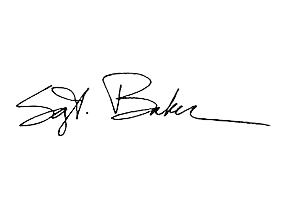
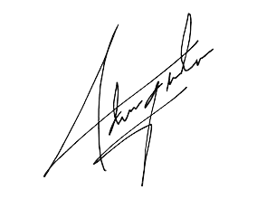

# Ethical Hacking Report

**Client: SecureTech Solution**  
**Date: May 5, 2024**  
**Prepared by: Mark Anthony A. Llorin, Christine Joy Dichoso / Certified Ethical Hacker**

---

## Executive Summary:

In accordance with our ethical hacking engagement with SecureTech Solution, our team conducted a comprehensive assessment of your network infrastructure, web applications, and systems. The purpose was to identify vulnerabilities and potential security threats that could compromise the confidentiality, integrity, and availability of your sensitive data and systems. Our assessment uncovered several critical and high-risk vulnerabilities that require immediate attention and remediation. This report outlines the identified vulnerabilities and provides recommendations for mitigating these risks.

---

## Vulnerability Assessment Findings:

1. **SQL Injection (Critical):**

   - Description: The web application is vulnerable to SQL injection attacks, allowing attackers to execute arbitrary SQL queries and potentially gain unauthorized access to the database.

2. **Cross-Site Scripting (XSS) (Critical):**

   - Description: The web application lacks proper input validation, enabling attackers to inject malicious scripts into web pages viewed by other users.

3. **Sensitive Data Exposure (High):**

   - Description: Sensitive information such as passwords or personally identifiable information (PII) is transmitted over insecure channels or stored in plaintext format, making it vulnerable to interception or unauthorized access.

4. **Outdated Software (High):**

   - Description: Several systems and applications are running outdated software versions with known vulnerabilities, increasing the risk of exploitation by attackers.

5. **Weak Passwords (High):**

   - Description: Users are using weak or easily guessable passwords, which could be exploited by attackers to gain unauthorized access to accounts.

6. **Insecure Direct Object References (IDOR) (High):**

   - Description: The application lacks proper authorization checks, allowing attackers to manipulate object references and access unauthorized resources.

7. **Missing Security Headers (Medium):**

   - Description: The web application is missing security headers such as HTTP Strict Transport Security (HSTS) and X-Content-Type-Options, which can help prevent various types of attacks.

8. **File Inclusion Vulnerabilities (Medium):**

   - Description: The application allows the inclusion of files from external sources without proper validation, potentially leading to remote code execution or disclosure of sensitive information.

9. **Security Misconfiguration (Medium):**

   - Description: Systems and applications are configured with default settings or unnecessary services enabled, exposing them to exploitation and unauthorized access.

10. **Session Fixation (Medium):**

    - Description: The application is vulnerable to session fixation attacks, where an attacker can hijack a user's session by fixing their session ID.

11. **Insecure Cryptographic Storage (Medium):**

    - Description: Sensitive data such as passwords or encryption keys are stored using weak or insecure cryptographic algorithms, making them susceptible to brute-force attacks.

12. **Clickjacking (Low):**

    - Description: The web application is vulnerable to clickjacking attacks, where attackers can trick users into clicking on malicious elements disguised as legitimate content.

13. **Cross-Site Request Forgery (CSRF) (Low):**

    - Description: The application lacks CSRF protection, allowing attackers to forge malicious requests on behalf of authenticated users.

14. **Unvalidated Redirects and Forwards (Low):**

    - Description: The application contains unvalidated redirects and forwards, which can be abused by attackers to redirect users to malicious websites or phishing pages.

15. **XML External Entity (XXE) Injection (Low):**
    - Description: The application processes XML input without proper validation, allowing attackers to exploit XXE vulnerabilities and potentially disclose sensitive information or execute arbitrary code.

---

## Recommendations:

1. **SQL Injection (Critical):**

   - Implement parameterized queries or use ORM frameworks to mitigate SQL injection vulnerabilities. Regularly sanitize user inputs and employ web application firewalls (WAFs) to filter and block malicious SQL queries.

2. **Cross-Site Scripting (XSS) (Critical):**

   - Implement input validation and output encoding techniques to prevent XSS attacks. Utilize Content Security Policy (CSP) headers to restrict the execution of inline scripts.

3. **Sensitive Data Exposure (High):**

   - Encrypt sensitive data in transit using secure protocols like HTTPS. Employ strong encryption algorithms to protect stored data and ensure secure storage practices, such as hashing passwords with salt.

4. **Outdated Software (High):**

   - Establish a patch management process to regularly update and patch software vulnerabilities. Conduct vulnerability scans and implement automated tools to identify and remediate outdated software.

5. **Weak Passwords (High):**

   - Enforce strong password policies requiring complex passwords with a minimum length and regular password expiration. Implement multi-factor authentication (MFA) to add an extra layer of security.

6. **Insecure Direct Object References (IDOR) (High):**

   - Implement access controls and enforce proper authorization checks to prevent IDOR attacks. Utilize session tokens or unique identifiers to validate user permissions.

7. **Missing Security Headers (Medium):**

   - Configure web servers to include appropriate security headers to mitigate common web vulnerabilities. Enable HSTS to enforce secure HTTPS connections and prevent downgrade attacks.

8. **File Inclusion Vulnerabilities (Medium):**

   - Validate user-supplied input and sanitize file paths to prevent directory traversal attacks. Limit file inclusion to trusted directories and avoid dynamic file inclusion whenever possible.

9. **Security Misconfiguration (Medium):**

   - Conduct regular security audits to identify and address misconfigurations. Follow security best practices, such as disabling unused services, minimizing attack surface, and implementing least privilege access controls.

10. **Session Fixation (Medium):**

    - Generate new session IDs upon successful authentication and invalidate old session IDs. Implement secure session management techniques, such as session expiration and token rotation.

11. **Insecure Cryptographic Storage (Medium):**

    - Utilize strong cryptographic algorithms and key management practices to securely store sensitive data. Implement industry-standard encryption techniques and regularly review cryptographic implementations for weaknesses.

12. **Clickjacking (Low):**

    - Implement frame-busting techniques and X-Frame-Options headers to prevent clickjacking attacks. Utilize JavaScript-based solutions to detect and prevent frame-based attacks.

13. **Cross-Site Request Forgery (CSRF) (Low):**

    - Implement CSRF tokens and enforce same-origin policy to mitigate CSRF attacks. Include anti-CSRF tokens in forms and validate requests to ensure they originate from trusted sources.

14. **Unvalidated Redirects and Forwards (Low):**

    - Avoid using user-supplied input to construct redirect URLs. Implement whitelisting or validation checks to ensure that redirect destinations are legitimate and safe.

15. **XML External Entity (XXE) Injection (Low):**
    - Disable external entity parsing or enable secure processing features in XML parsers to prevent XXE attacks. Sanitize XML input and validate against a predefined schema to block malicious payloads.

---

## Conclusion:

The findings of this ethical hacking assessment highlight several critical and high-risk vulnerabilities that pose significant security risks to SecureTech Solution's systems and data. It is imperative that immediate action is taken to address these vulnerabilities and implement the recommended remediation measures to strengthen the overall security posture. Continuous monitoring, regular security assessments, and adherence to security best practices are essential to mitigate future security threats and safeguard against potential breaches.

{width=150px}{width=150px}
